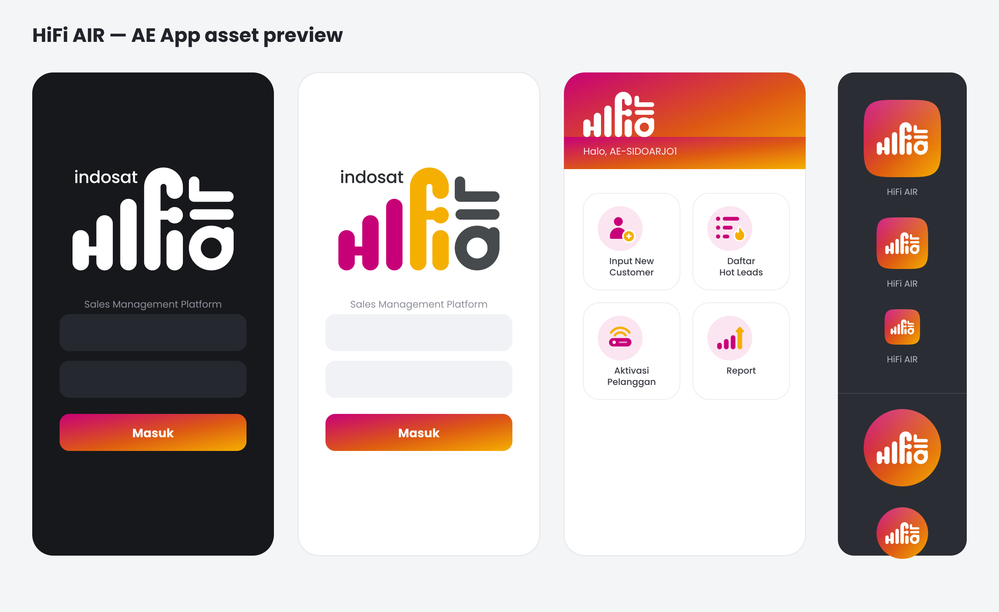

# HiFi AIR — AE App Asset Pack

Brand assets for the **FWA Sales Digitalization / HiFi AIR AE Android app** (Flutter).
Every asset is generated from vector masters, so any size can be re-exported cleanly.



---

## 1. Brand palette

| Token | Hex | Use |
|---|---|---|
| `hifiMagenta` | `#C80078` | Primary. Logo "hi" bars, icon primary shapes, buttons |
| `hifiAmber` | `#F5AF00` | Secondary. Logo "fi", icon accents, highlight states |
| `hifiCharcoal` | `#464A4D` | Logo "air", body text, neutral icons |
| `hifiInk` | `#2A2E31` | "indosat" wordmark, headings |
| `hifiTintMagenta` | `#FBE5F1` | Icon container fill on light surfaces |
| Gradient | `#C80078` → `#DD5A12` (56%) → `#F5AF00` | App icon tile, primary CTA, app bar |

```dart
// lib/core/theme/brand_colors.dart
class Brand {
  static const magenta  = Color(0xFFC80078);
  static const amber    = Color(0xFFF5AF00);
  static const charcoal = Color(0xFF464A4D);
  static const ink      = Color(0xFF2A2E31);
  static const tint     = Color(0xFFFBE5F1);
  static const gradient = LinearGradient(
    begin: Alignment.topLeft, end: Alignment.bottomRight,
    colors: [Color(0xFFC80078), Color(0xFFDD5A12), Color(0xFFF5AF00)],
    stops: [0.0, 0.56, 1.0],
  );
}
```

---

## 2. What's in the pack

```
svg/
  logo/
    hifiair-lockup-color.svg     indosat + hifi air, full colour   ← light backgrounds
    hifiair-lockup-white.svg     all-white lockup                  ← dark backgrounds / gradient
    hifiair-mark-color.svg       hifi air mark only (no wordmark)
    hifiair-mark-white.svg       mark only, white                  ← app bar on gradient
    hifiair-mark-mono.svg        mark only, single charcoal
  app-icon/
    app-icon.svg                 1024 squircle, gradient tile, white mark
    app-icon-round.svg           circular variant
    app-icon-square.svg          full-bleed square (Play Store)
    adaptive-foreground.svg      432 foreground layer, inside the 66dp safe zone
    adaptive-background.svg      432 gradient background layer
  icons/
    ic_input_new_customer.svg    with tinted circle container
    ic_input_new_customer-glyph.svg   glyph only, transparent
    ic_hot_leads.svg / -glyph.svg
    ic_customer_activation.svg / -glyph.svg
    ic_report.svg / -glyph.svg

png/                             Flutter density convention
  <name>.png                     1x
  2.0x/<name>.png  3.0x/  4.0x/
  app_icon@1024.png              standalone hi-res
  hifiair_lockup_color@2048.png
  hifiair_lockup_white@2048.png

android/
  res/mipmap-{mdpi..xxxhdpi}/    ic_launcher, ic_launcher_round,
                                 ic_launcher_foreground, ic_launcher_background
  res/mipmap-anydpi-v26/         ic_launcher.xml, ic_launcher_round.xml
  res/drawable/                  ic_launcher_background.xml (gradient shape),
                                 ic_launcher_monochrome.png (themed icons, Android 13+)
  play-store/                    ic_launcher-512.png, feature-logo-1024.png
```

Base 1x sizes: logos **220 px wide**, menu icons **48 px**, app icon **96 px**.

---

## 3. Installing

### App icon (Android)

Copy `android/res/**` over `android/app/src/main/res/`, then make sure
`AndroidManifest.xml` points at it:

```xml
<application
    android:icon="@mipmap/ic_launcher"
    android:roundIcon="@mipmap/ic_launcher_round"
    android:label="HiFi AIR">
```

Android 8+ picks up `mipmap-anydpi-v26/ic_launcher.xml` automatically and composes
the gradient background with the white mark, so the icon adapts to whatever mask
the launcher uses (circle, squircle, teardrop). Android 13+ themed icons use
`drawable/ic_launcher_monochrome.png`.

> If you prefer to regenerate from a single source later, the same look can be
> reproduced with `flutter_launcher_icons` pointed at `png/app_icon@1024.png`.

### Images (Flutter)

Copy `png/**` into `assets/images/` and declare the **base folder only** — Flutter
resolves `2.0x/3.0x/4.0x` automatically:

```yaml
flutter:
  assets:
    - assets/images/
```

```dart
Image.asset('assets/images/hifiair_lockup_white.png', width: 200)  // login screen
Image.asset('assets/images/ic_report.png', width: 48)              // dashboard tile
```

For sharpest results, consider `flutter_svg` and shipping `svg/**` instead —
one file per asset, perfect at any size:

```dart
SvgPicture.asset('assets/svg/logo/hifiair-lockup-white.svg', width: 200)
```

---

## 4. Usage rules

**Login screen** — use the full lockup (`hifiair-lockup-*`). White version on the
dark or gradient variant, colour version on white. Minimum width **140 px**; below
that the "indosat" wordmark stops being legible — switch to the mark only.

**App bar / compact spots** — use the mark only (`hifiair-mark-white`), height
24–32 dp.

**Clear space** — keep free space equal to the height of the tallest pink bar on
all sides of the lockup.

**Don't** — recolour the mark outside the palette above, stretch it non-uniformly,
add shadows or outlines to it, or place the colour version on a mid-tone or
photographic background (use the white version there).

**Menu icons** — the container version is drawn for a 48–56 dp tile in the dashboard
grid. Use `-glyph` versions when you need the icon on an already-tinted surface
or when you want to tint it yourself. Icon meanings:

| Asset | Screen |
|---|---|
| `ic_input_new_customer` | Input New Customer / Daftar New Customer |
| `ic_hot_leads` | Daftar Hot Leads |
| `ic_customer_activation` | Aktivasi Pelanggan / Daftar Aktivasi |
| `ic_report` | Report + Home dashboard performance |

---

## 5. Notes on provenance

The four menu icons in the original hand-off were emoji placeholders
(📌 📦 🧑 📈). They have been replaced with purpose-drawn icons in the HiFi AIR
visual language: soft-rounded geometry, magenta primary + amber accent, matching
the rounded bar shapes of the parent logo.

The `hifi air` mark was rebuilt as clean vector geometry from the supplied 167 px
raster, so it stays crisp at any size. The "indosat" wordmark is set in **Poppins
Medium**, the closest widely available match to the corporate logotype — if you
can obtain the official Indosat logotype outlines, swap that one path in
`svg/logo/hifiair-lockup-*.svg` before anything goes to print or public release.
